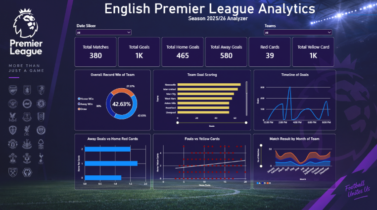

# English Premier League Analytics: Power BI Dashboard

An interactive Power BI dashboard analysing the **2025/26 English Premier League season** (380 matches, 20 teams), with a focus on **home vs away performance** and on relationships between match statistics such as fouls, cards, shots and goals.

## Dashboard Preview



## Dataset

- **File:** `EnglishPremierLeague_cleaned.csv`
- **Grain:** one row per match (380 rows)
- **Key columns:**
  - Match info: `Match_Date`, `Match_Time`, `Home_Team`, `Away_Team`, `Referee`
  - Results: `Full_Time_Home_Goals`, `Full_Time_Away_Goals`, `Full_Time_Result` (H / D / A), half-time equivalents
  - Match stats (home and away): shots, shots on target, fouls, corners, yellow cards, red cards

## Dashboard Overview

**Filters**
- Date slicer
- Team slicer (every visual responds to it)

**KPI cards**
| KPI | Value |
|---|---|
| Total Matches | 380 |
| Total Goals | 1,045 |
| Total Home Goals | 465 |
| Total Away Goals | 580 |
| Red Cards | 39 |
| Total Yellow Cards | 1,424 |

**Visuals**
1. **Overall Record Win of Team** (donut): share of Home Win / Away Win / Draw (42.63% / 30% / 27.37%)
2. **Team Goal Scoring** (bar): total goals scored by each team
3. **Timeline of Goals** (line): goals by kickoff time slot
4. **Away Goals vs Home Red Cards** (bar): average away goals by number of home red cards
5. **Fouls vs Yellow Cards** (scatter with trend line): correlation between home fouls and home yellow cards
6. **Match Result by Month of Team** (stacked area): home wins, draws and away wins across the season

## Key Insights

- **Home advantage exists but is modest:** home teams won about 43% of matches versus 30% for away teams.
- **Fouls and yellow cards move together:** the correlation between home fouls and home yellow cards is moderate and positive (r ≈ 0.31).
- **Red cards affect the opponent:** away teams averaged about 1.7 goals when the home side had a player sent off, versus about 1.2 with no red card. Only 17 matches had a home red card, so this is a small sample.
- **Fouls and goals show no relationship** (r ≈ -0.04).

## Tools and Techniques

- **Power BI Desktop** for data modelling and visualisation
- **DAX** for calculated columns and measures (for example, `Match_ID`, total goals, correlation measures)
- Custom dark theme with Premier League styling
- Interactive slicers for date and team filtering
- Scatter charts with trend lines to visualise correlation

## Repository Contents

```
├── EnglishPremierLeague_cleaned.csv   # source data
├── EPL_Analytics.pbix                 # Power BI report
├── dashboard_preview.png              # dashboard screenshot
└── README.md
```

## How to Use

1. Download or clone this repository.
2. Open `EPL_Analytics.pbix` in **Power BI Desktop**.
3. If prompted, point the data source to your local copy of `EnglishPremierLeague_cleaned.csv`.
4. Use the Date and Team slicers to explore the season.

## Possible Extensions

- League table (points, goal difference) built with a team-perspective table
- Shots on target vs goals conversion analysis
- Referee-level discipline analysis
- Home vs away comparison for corners and shots
